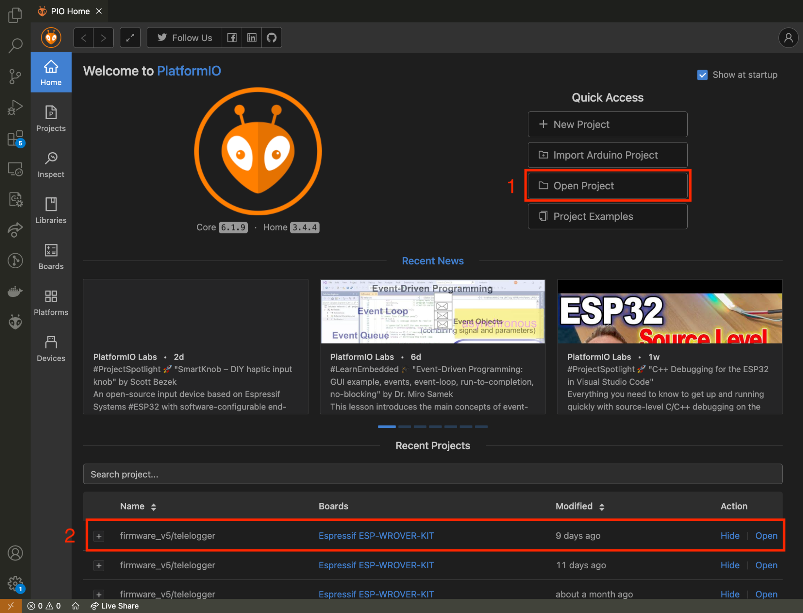

&nbsp;
&nbsp;
<p align="center">
  
</p> 

&nbsp;

# MMCloud: an Online Unsupervised Clustering Algorithm for Driver Behavior Analysis

### ✍🏾Authors: [Morsinaldo Medeiros](https://github.com/Morsinaldo), [Marianne Diniz](https://github.com/MarianneDiniz), [Ivanovitch Silva](https://github.com/ivanovitchm)

## 1. Abstract/Overview

The increasing integration of Internet of Things (IoT) technologies into modern vehicles has enabled real-time access to driving data. However, analyzing this information in embedded environments remains challenging due to the continuous nature of the data streams and the limited computational resources available. This study addresses these constraints by proposing an evolving online clustering approach for real-time monitoring of driver behavior. The proposed method integrates Tiny Machine Learning (TinyML) techniques with soft sensors derived from physical data captured via on-board diagnostics (OBD-II). Central to the system is the MMCloud algorithm, which incrementally updates clusters without requiring retraining, enabling adaptation to concept drift and evolving driving conditions. The methodology involves the real-time acquisition of vehicle signals, including speed, RPM, engine load, and throttle position, followed by the calculation of a soft-sensor metric known as radar area. The algorithm was deployed on a Freematics One+ device and validated through case studies conducted in varied urban driving conditions. The results indicate that the system can classify driver behavior into cautious, normal, and aggressive categories, achieving Silhouette Scores up to 0.83 and maintaining execution times between 600–700 µs in most cases. These findings suggest that the approach is suitable for embedded applications requiring adaptive, real-time behavior analysis.

## 2. Repository Structure

```bash
EVOLVING-SYSTEMS-2024-MMCloud
├── data/               # Datasets used in the experiments
├── ESPRIT/             # Auxiliary scripts and methods (ESPRIT algorithm)
├── figures/            # Figures and images for documentation
├── firmware/           # Initial firmware implementation
├── firmware_v2/        # Firmware version 2
├── firmware_v3/        # Firmware version 3
├── firmware_v4/        # Firmware version 4
├── firmware_v5/        # Firmware version 5 (recommended)
├── libraries/          # External and custom libraries
├── maps/               # Map data generated after the experiments
├── server/             # Server-side implementation for data collection
├── experiment_analysis.ipynb  # Notebook for experiment analysis
├── .gitignore          # Git ignore rules
├── LICENSE             # Project license (MIT)
└── README.md           # Project documentation
```

## 3. Environment Setup

1. Install [Visual Studio Code](https://code.visualstudio.com/)
2. Install [PlatformIO](https://platformio.org/) (VSCode Extension)
3. Clone this repository:

```bash
git clone https://github.com/conect2ai/EVOLVING-SYSTEMS-2024-MMCloud.git
```

4. Open the project folder `./Freematics/firmware_v5/telelogger` on PlatformIO, as illustrated in the figure below.

<p align="center">
  
</p> 

5. Connect the Freematics One+ to your computer and turn it on using the Freematics Emulator or in the vehicle.

6. Compile, upload and monitor the serial (steps 1, 2 and 3, respectively in the figure below).

<p align="center">
  
</p> 


## :wrench: Network Configurations

All collected information can be sent to a server and stored locally on the SD card. The hardware allows sending information via both Wi-Fi and 4G. You can configure things like Wi-Fi name and password, server URL, server port, protocol, etc. in [config.h file](./firmware_v5/telelogger/config.h).

```C
// config.h file 

/**************************************
* Configuration Definitions
**************************************/
// ...

// define your email
#define USER_EMAIL "email@email.com"

/**************************************
* Networking configurations
**************************************/
#ifndef ENABLE_WIFI
#define ENABLE_WIFI 0
// WiFi settings
#define WIFI_SSID "FREEMATICS"
#define WIFI_PASSWORD "PASSWORD"
#endif 

#ifndef SERVER_HOST
// cellular network settings
#define CELL_APN "claro.com.br"
// Freematics Hub server settings
#define SERVER_HOST "serverconect2ai.dca.ufrn.br"
#define SERVER_PROTOCOL PROTOCOL_HTTP
#endif

// SIM card setting
#define SIM_CARD_PIN ""

// HTTPS settings
#define SERVER_METHOD PROTOCOL_METHOD_POST
#define SERVER_PATH "/freematics"

#if !SERVER_PORT
#undef SERVER_PORT
#if SERVER_PROTOCOL == PROTOCOL_UDP
#define SERVER_PORT 8081
#elif SERVER_PROTOCOL == PROTOCOL_HTTP
#define SERVER_PORT 1880
#elif SERVER_PROTOCOL == PROTOCOL_HTTPS
#define SERVER_PORT 443
#endif
#endif
```

If it is necessary to use mobile data to send data to the server, `ENABLE_WIFI` must be set to 0. In addition, `CELL_APN` must be configured according to the carrier used. The tests performed were with the Claro carrier. Below is a list of APNs for Brazilian carriers.

- TIM: "timbrasil.br"
- Claro: "claro.com.br"
- Oi: "gprs.oi.com.br"
- Vivo: "zap.vivo.com.br"

## :page_facing_up: License

This project is licensed under the MIT License - see the [LICENSE](LICENSE) file for details.

# About us

The [**Conect2AI**](http://conect2ai.dca.ufrn.br) research group is composed of undergraduate and graduate students from the Federal University of Rio Grande do Norte (UFRN) and aims to apply Artificial Intelligence (AI) and Machine Learning in emerging areas. Our expertise includes Embedded Intelligence and IoT, optimizing resource management and energy efficiency, contributing to sustainable cities. In the energy transition and mobility, we apply AI to optimize energy use in connected vehicles and promote more sustainable mobility.

